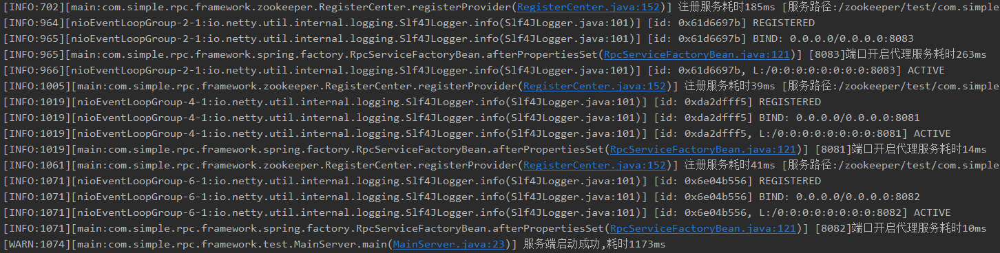
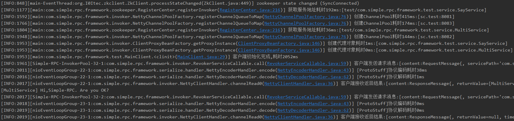

# Simple-RPC
基本功能完整的RPC框架，供学习使用。如有错误和建议，欢迎交流。

VX: sicor1994

## 食用说明

本Simple-RPC项目框架主要参考《架构探险：从零开始写分布式服务框架》的项目源码，自己做了很多自定义化的修改、改进和增强。

Simple-RPC并没有达到商用的标准，但是作为一个学习参考项目，它是非常合适的。麻雀虽小，五脏俱全，Simple-RPC拥有RPC框架的所有核心功能（可能是乞丐版），会涉及到**Spring、Neety、Zookeeper、JUC的某些类、序列化协议、负载均衡算法和简单并发编程**等技能点。下面对Simple-RPC的特点进行简要介绍。

### Spring集成

- 本项目集成Spring，支持“一键启动”
- 将项目打包到本地仓库，即可直接当RPC框架使用

### 配置文件

- 全局配置文件【simple-rpc.properties】+  标签配置文件【rpc-reference.xml】和 【rpc-service.xml】，支持高度自定义、可优化
- 大部分配置项支持缺省配置和容错配置

### 序列化

- 使用了简单的自定义通信协议：int(序列化协议信息) + int(data长度) + data(待传输数据)
- 支持ProtoStuff和Hessian两种序列化协议，并且方便拓展
- 支持客户端和服务端选择不同的序列化协议

### 负载均衡策略

- 提供了 Random / WeightRandom / Polling / WeightPolling / Hash 5种均衡算法的简单实现
- 支持组合策略配置：在rpc-reference.xml中引用服务时，各服务可配置不同的负载均衡策略

### 注册中心

- 支持标签发布服务和引用服务，满足服务自动注册和发现的要求
- 支持服务地址变更自动感知：实时推送变化的服务地址到客户端

### 优化

- 支持Timeout设计
- 初始化时，自动为不同的服务地址生成ChannelPool，提高连接速度
- 发布服务时可以自定义该服务的限流信号量大小，提升系统稳定性
- 客户端调用RPC服务使用统一线程池，线程池大小可配置
- 使用阻塞队列同步等待Netty的异步返回结果

### 改进

- 提供了服务治理的接口功能，但是服务治理模块还没有实现，复杂的调用链分析没有做


## 使用说明

### 先RUN起来

简单介绍如何将本项目在你的电脑上RUN起来

1. 下载[zookeeper](https://note.youdao.com/ynoteshare1/index.html?id=65dd9de0a5ad1a2b2858d4295d523e22&type=note)，参考[这里](https://www.jianshu.com/p/fb190c6d9768)将zookeeper在你的windows上运行起来，注意使用zookeeper时不要关闭CMD窗口

2. clone本项目到本地，使用IDEA打开(没试过Eclipse导入本项目，不建议使用)，配置maven和本地仓库，等待依赖自动导入完成（不会使用maven？Google/Baidu可以帮助你）

3. 找到`com.simple.rpc.framework.test.MainServer`，运行它的main方法，可以看到控制台打印服务端的启动日志；再找到`com.simple.rpc.framework.test.MainClient`，同样运行它的main方法，可以看到控制台打印客户端的运行日志。

    

    

    MainClient中提供了简单的调用RPC服务测试用例，直接RUN即可。你也可以设置自己的接口和实现类，但是注意需要在rpc-service.xml和rpc-reference.xml中发布和引用你创建的服务。

### 再来自定义RUN

本项目自定义的配置文件有：simple-rpc.properties / rpc-service.xml / rpc-reference.xml

#### simple-rpc.properties

它是全局配置文件，配置了ZK地址和参数、默认负载均衡策略、采用的序列化协议等，具体可以参考该文件中的注释说明。除了以下情况的必须配置项，其他配置都有缺省值

- simple.rpc.zookeeper.address代表的ZK地址必须配置
- 发布服务时, 如果存在没有配置appName属性的标签, 那么simple.rpc.server.app.name必须配置
- 引用服务时, 如果存在没有配置appName属性的标签, 那么simple.rpc.client.app.name必须配置

#### rpc-service.xml

它是发布服务的配置文件，主要包含了simple:service标签，示例如下

```xml
<simple:service id="sayServiceRegister1"
                appName="simple"
                interface="com.simple.rpc.framework.test.service.SayService"
                ref="sayService1"
                weight="50"
                workerThreads="100"
                serverPort="8083"
                timeout="2000"
                groupName="default"/>
```

- id：不同的simple:service要求id属性不一样
- appName：该属性如果缺失，就会采用全局配置文件 simple-rpc.properties 中的 simple.rpc.server.app.name 值，如果两者都缺失，就会报错
- interface：接口的全限定名（appName + interface是该服务在注册中心的key）
- ref：该接口的实现类bean标签的id
- weight：提供服务时该主机的权重值（范围[1,100]）
- workerThreads：该主机提供该服务的限流数
- serverPort：该主机发布该服务的端口号
- timeout：服务超时时间
- groupName：应用所属分组名称， 本项目未用到。如果要在ZK中设置更复杂的注册路径，可以使用

注意到，框架是支持将服务发布在不同的端口的，同时也支持对同一个接口，发布不同的服务实现类

#### rpc-reference.xml

它是引用服务的配置文件，主要包含了simple:reference标签，示例如下

```xml
<simple:reference id="sayService"
                  appName="simple"
                  interface="com.simple.rpc.framework.test.service.SayService"
                  clusterStrategy="WeightRandom"
                  timeout="2000"
                  groupName="default"/>
```

- id：不同的simple:reference要求id属性不一样
- appName：该属性如果缺失，就会采用全局配置文件 simple-rpc.properties 中的 simple.rpc.client.app.name 值，如果两者都缺失，就会报错
- interface：接口的全限定名（appName + interface是该服务在注册中心的key）
- clusterStrategy：采用的载均衡策略，缺省时就使用全局配置文件 simple-rpc.properties 中的 simple.rpc.client.clusterStrategy.default 值， 如果两者都缺省，就使用框架的默认值(Random)
- timeout：服务超时时间
- groupName：应用所属分组名称， 本项目未用到。如果要在ZK中设置更复杂的注册路径，可以使用

### 还可以依赖RUN

因为这是一个RPC框架，它当然是可以作为jar包被其他项目依赖使用的。

使用maven的install命令，将项目打包到本地仓库，其他项目依赖时的dependency如下

```xml
<dependency>    
    <groupId>com.jacksu.learn</groupId>
    <artifactId>simple-rpc</artifactId>
    <version>1.0-SNAPSHOT</version>
</dependency>
```

作为依赖在新项目中使用时，必须提供配置文件：simple-rpc.properties / rpc-service.xml / rpc-reference.xml， 且它们都要放在 /resource 根目录下，然后创建自己的接口和实现类，并按要求码配置标签即可使用。（和Dubbo的使用要求是类似的）

偷个懒：直接将原项目 com.simple.rpc.framework.test 包中内容 和 /resources 下的配置文件都copy到新项目中，即可测试使用。


## 学习说明

这里教你如何从零开发Simple-RPC框架（待补充整理）

(开发过程中，做了一些笔记，暂时放在[这里](./doc/simple-rpc-framework.md)作为参考，注意其中可能有很多地方和实际项目有出入，因为项目后面又改动了很多，没有及时更新文档，有时间再整理一下)


