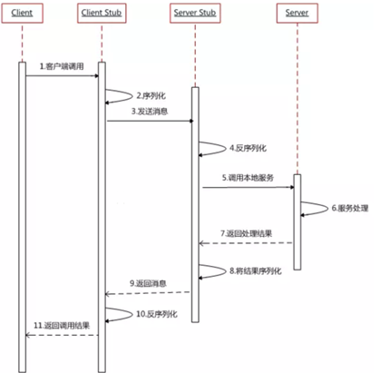
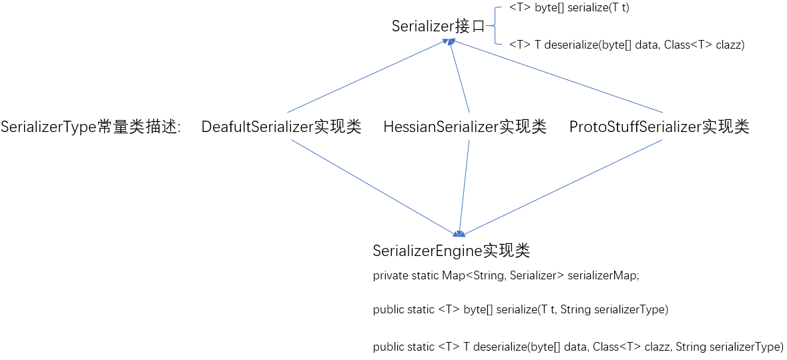
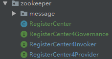
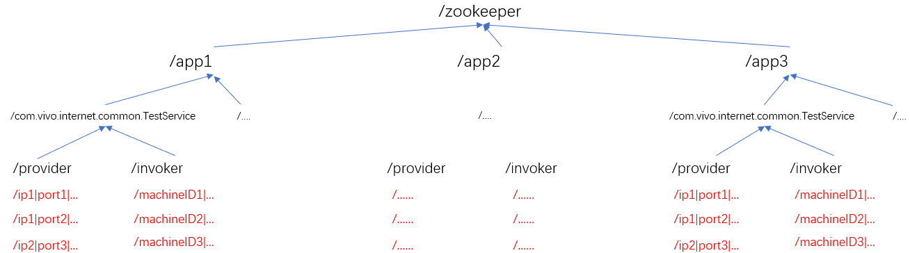
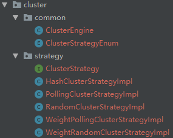
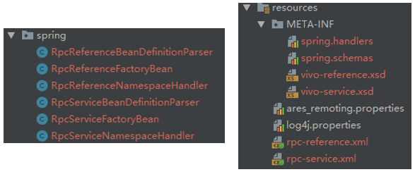

## Simple-RPC简介

### 什么是RPC

RPC(Remote Procedure Call, 远程过程调用), 其目的是让使用者调用远程服务时, 感觉和调用本地服务是一样的效果.

回顾一下我们是怎么调用本地服务的? 首先, 创建一个接口, 然后写一个接口实现类, 然后在Spring中注册这个接口实现类的Bean, 最后要使用时, 我们一般使用如下形式即可:

```java
@Autowired
SayService sayService;
```

而在现实开发中, 我们只会负责一部分接口开发, 剩下的接口我们经常需要调用别人的(我们会引入别人接口的依赖包, 但是它不包含接口的实现类). 使用RPC框架, 就可以像上面的形式一样, 去调用远程接口, 区别只是注册Bean不再是通过Spring的bean标签, 而是使用RPC框架特有的标签(其实还是由Spring去解析)

那么你可能会问了: 为什么别人不把接口和实现类都放在一个依赖包, 这样我就不用远程调用了. 这样确实是可行的, 但是在实际业务开发中, 接口的实现经常改变, 如果每次改变实现都要重新发个包让所有调用者都去更换依赖, 那样非常麻烦. 而用了RPC框架, 只是接口提供者自己更新实现即可

**那一次RPC调用过程是怎样的呢?**



上图就是一次完整的RPC过程, 使用者每调用一次远程接口的方法, RPC框架都会执行1~11步, 对于高性能的RPC框架, 这些步骤很快就能完成. 所以使用者感受不到自己是在调远程接口.

### RPC框架启动流程

RPC框架既与服务端"打交道", 又与"客户端"打交道. 使用它, 你既可以发布自己的服务, 也可以声明调用别人的服务. 服务端和客户端的启动流程都交给Spring来完成, 使用者只用配置相应的标签即可, 就像配置Spring的bean标签一样简单自然.

#### 服务端启动流程

1. 读取配置文件, 获取所有RPC服务声明
2. 向zk中注册服务
3. 开启服务代理server
4. 后续: 接收客户端的请求, 按请求调用实际执行类, 返回结果

#### 客户端启动流程

1. 读取配置文件, 获取所有引用RPC服务的声明
2. 从zk中获取这些服务的信息列表缓存到本地, 并注册监听器, 实时推送改变这个本地缓存
3. 由2中获取的本地缓存, 进行ChannelPool的初始化: 本地针对每个不同的地址(ip:port), 生成一定数量的Channel. 也就是说与若干提供rpc服务的远程主机提前建立了Channel并进行复用
4. 为1中每个引用服务生成一个单例的代理对象, 并交给IOC容器管理
5. 后续: 客户端代码里调用rpc服务接口方法时, 会由代理对象发送请求和获取结果

### 序列化/反序列化

**特性**

- 多种序列化方案自由配置
- 客户端和服务端可以选择不同的序列化方案

市面上有很多成熟的序列化方案, 本项目用到三种:Default / Hessian / ProtoStuff. 首先说明一下遇到这种情况: 一个功能有多种实现类, 如何优雅的选择? 使用门面模式, 如下图



首先为这个功能定义一个接口, 然后让所有实现类实现这个接口, 再加一个常量类, 其中主要存储代表不同实现类的字符串常量, 最后用一个Engine类即可以实现优雅的选择. 这个类中有一个map, 存储着实现类的键值对, key就是常量类里的不同常量, value是不同实现类的对象, map的初始化可以放在一个static代码块中. 然后提供和功能接口一样的方法, 唯一的区别就是, 每个方法参数多了一个type, 根据这个type在map中找对应的实现类对象去执行实际的功能方法.

我们只用一个Engine类 + 一个type字符串就可以优雅调用不同实现类. 后面的负载均衡多实现类也是采用相同的思想

**Default序列化**

默认的序列化采用的是Jackson, Jackson可以将任意对象变成json字符串或byte数组, 但是在将json/byte数组转换为对象时, 可能会出现问题. 

比如下面的对象p, 它反序列化的时候pet属性会被变成一个LinkedHashMap. 这是因为反序列化时只传入Person.class, 而这个类的pet属性是Object类, Jackson不知道它是一个Cat类的对象, 所以不能反序列化成功. 

在rpc框架中要传递的消息正是这种情况, 代理对象在反射执行invoke方法时, 需要将方法的参数, 一个Object数组, 装到消息中, 发送到服务提供方, 服务提供方在收到消息后, 因为不知道这些参数具体类型, 反序列化就会出错. 这里的解决办法是, 将方法参数的类型也装到消息中, 反序列化时, 借助方法参数类型, 把这些方法参数重新序列化/反序列化一次, 显然这样并不是一个优雅的方案. 一次性序列化方案: 将对象按属性顺序变成byte, 然后将属性的真实类型也一起变成byte存储, 这样在反序列化时, 使用存储的真实类型反序列化即可.

````java
class Cat {
    String name;
    Integer age;
}
Class Person {
    String name;
    Object pet;
}
Person p = new Person("sc");
p.setPet(new Cat("miao", 1));
````

**Hessian**

> Hessian是一个轻量级的remoting onhttp工具，使用简单的方法提供了RMI的功能。 相比WebService，Hessian更简单、快捷。采用的是二进制RPC协议，因为采用的是二进制协议，所以它很适合于发送二进制数据。

注意, 使用Hessian序列化协议时, 类需要实现Serializable接口. Hessian相比Java原生序列化, 序列化后的二进制数据量更小, 因此传输速度和解析速度都更快. 它支持跨语言, 有以下两个特点:

- 采用简单的结构化标记, 并且只存储对象数据内容部分, 而Java原生序列化还会存一些继承关系之类
- 采用引用取代重复遇到的对象, 避免了重复编码

**ProtoStuff**

protostuff 基于Google protobuf，但是提供了更多的功能和更简易的用法。其中，protostuff-runtime 实现了无需预编译对java bean进行protobuf序列化/反序列化的能力。protostuff-runtime的局限是序列化前需预先传入schema(可以由代码方法生成, 不需要手动改创建)，反序列化不负责对象的创建只负责复制，因而必须提供默认构造函数。此外，protostuff 还可以按照protobuf的配置序列化成json/yaml/xml等格式。

在性能上，protostuff不输原生的protobuf，甚至有反超之势。

#### 编码解码

以上都只是对序列化的介绍, 而在rpc的网络传输中, 被传输的是字节流, 我们还要制定这个字节流的组成规则, 也就是编码的过程. byte编码器需要继承MessageToByteEncoder, 重写encode方法. 如下

其中规定了字节流在传输的时候由三部分组成: int + int + data. 第一个int代表了这个字节流中data变成byte时候采用的序列化协议, 第二个int代表了这个字节流中data的长度, data是我们需要传输的数据序列化后的字节流.

```java
public void encode(ChannelHandlerContext ctx, Object in, ByteBuf out) throws Exception {
    // 确定序列化协议的int码
    int serializerCode = SerializerType.getCodeByType(serializerType);
    out.writeInt(serializerCode);
    // 将对象序列化为字节数组
    byte[] data = SerializerEngine.serialize(in, serializerType);
    // 将字节数组(消息体)的长度作为消息头写入,解决半包/粘包问题
    out.writeInt(data.length);
    // 最后才写入序列化后得到的字节数组
    out.writeBytes(data);
}
```

解码就是在知道编码规则后, 按编码规则解码, byte解码器需要继承ByteToMessageDecoder类, 重写decode方法, 如下

两个int占8个字节, 所以在能读取量少于8字节时, 先不读数据, 等到有了数据后, 要按编码顺序, 先读取序列化协议的int, 再读取data长度的int, 最后才根据长度读取data, 并且根据第一个int获取的序列化协议, 将data字节反序列化成对象, 这是一个完整的解码步骤. 

```java
public void decode(ChannelHandlerContext ctx, ByteBuf in, List<Object> out) throws Exception {
    long time = System.currentTimeMillis();
    // 头部消息8字节:序列化协议int + 数据长度int
    if (in.readableBytes() < 8) {
        return;
    }
    in.markReaderIndex();
    int serializerCode = in.readInt();
    String serializerType = SerializerType.getTypeByCode(serializerCode);
    int dataLength = in.readInt();
    if (dataLength < 0) {
        ctx.close();
    }
    // 若当前可以获取到的字节数小于实际长度,则直接返回,直到当前可以获取到的字节数等于实际长度
    if (in.readableBytes() < dataLength) {
        in.resetReaderIndex();
        return;
    }
    // 读取完整的消息体字节数组
    byte[] data = new byte[dataLength];
    in.readBytes(data);
    //将字节数组反序列化为java对象(SerializerEngine参考序列化与反序列化章节)
    Object obj = SerializerEngine.deserialize(data, genericClass, serializerType);
    out.add(obj);
    time = System.currentTimeMillis() - time;
    logger.info("[{}]协议解码耗时[{}ms]", serializerType, time);
}
```

以上, 完成了netty网络传输流中重要的三个部分: 序列化协议 / 编解码规则 / 半包/粘包问题


### netty网络传输

**特性**

- ChannelPool: 客户端在启动时, 获取服务注册地址后, 就会针对每个地址, 建立一定数量的channel进行复用
- ThreadWorkers: 客户端调用rpc服务使用的线程数量是可控的
- 使用线程池submit连接请求, 阻塞等待返回结果, 支持timeout设计
- 基于阻塞队列, 使用返回结果容器(支持过期检查0接收结果, 在netty异步返回时, 阻塞等待结果.
- 服务端每个发布的服务, 都可以设置限流线程数量, 保证同时访问服务的最大客户端数量

**ChannelPool实现**

NettyChannelPoolFactory是单例模式, 其中有一个属性`Map<InetSocketAddress, ArrayBlockingQueue<Channel>> channelPoolMap`, 用来存储不同主机地址的channel通道, 可以看到channel通道是用阻塞队列存储, 这样做的好处是保证高并发时不会出错, 且和支持timeout设计吻合. 每个地址初始化的channel通道数量支持配置.

创建channel时, 因为netty是异步创建, 所以为ChannelFuture添加了监听器, 并使用了ConnectedLatch, 保证无论channel创建成功或失败, 都是同步返回结果, 并且失败就返回null, 正是因为创建channel可能失败, 所以在创建channel时, 使用以下代码, 必须有外部的while循环

```java
while (channel == null) {
    // 若channel创建失败,则重新创建
    channel = registerChannel(socketAddress);
}
```

channel在使用完后, 调用release的回收方法, 便于复用.

**ThreadWorkers**

创建客户端代理对象的ClientProxyBeanFactory类, 有一个static属性fixedThreadPool, 负责submit发起请求的线程, 它的线程数量由ThreadWorkers参数确定. 如下, 在这种一个连接请求, submit一个线程的模式下, 可以阻塞等待结果, 保证了timeout设计

```java
Future<ResponseMessage> responseMessage = fixedThreadPool.submit(RevokerServiceCallable.newCall(inetSocketAddress, request));
// 阻塞等待结果
ResponseMessage response = responseMessage.get(request.getTimeout(), TimeUnit.MILLISECONDS);
```

**返回结果容器设计**

首先提供一个返回结果包装类ResponseReceiver, 它有一个容量为1的`BlockingQueue<ResponseMessage>`属性用来存储结果, 用阻塞队列也是为了支持获取结果超时设计, 还有一个responseTime属性, 记录这个结果被创建的时间, 并提供一个方法isExpire检查该结果是否过期, 主要逻辑就是检查目前的时间和responseTime时间差, 是否超过结果的timeout参数.

返回结果容器ResponseReceiverHolder有一个属性`Map<String, ResponseReceiver> responseMap`, 用来存储结果, key是请求的id, 并且会提供一个`Executors.newSingleThreadExecutor()`单线程池不停去检查map中的结果是否过期, 避免内存溢出(正常情况下结果进去了容器马上就被取走, 但是异常情况时可能不会被取走, 因此这个线程是有必要的)

往结果容器中存结果是发生在NettyClientHandler的channelRead0方法, 即netty客户端异步获取了结果就立马存进容器, 从结果容器中获取结果是发生在RevokerServiceCallable中, 客户端write消息后, 就开始从结果容器中获取信息(阻塞), 注意从结果容器中获取信息的阻塞是因为结果包装类的阻塞队列提供的, 所以在write消息之前, 就要在结果容器中去生成这个消息id的消息包装类.

**服务端限流设计**

限流设计通过Semaphore实现, 它相当于操作系统中的信号量, 它的值在发布服务时可以配置, 客户端从注册中心中读取的信息里有, 会将这个值装进请求消息中, 因此服务端在执行每个请求时, 都会收到这个限流的影响. 保证了服务的稳定性, 也符合超时设计.

```java
try {
    //利用semaphore实现限流
    acquire = semaphore.tryAcquire(consumeTimeOut, TimeUnit.MILLISECONDS);
    if (acquire) {
        //利用反射发起服务调用
        response = new ServiceProvider().execute(request);
    } else {
        logger.warn("因为服务端限流,请求超时");
    }
}
```


### 注册中心

**特性**

- 服务自动注册: 集成了spring, 只用按规定格式提供配置文件和写xml发布服务, 即可自动注册
- 服务推送: 由于注册了监听器, 所以服务信息发生变化时, 会自动更新到本地缓存 

注册中心相当于信息仓库, 它存储了rpc调用需要的信息. 对于服务端来说, 需要将发布的服务相关信息按规定格式注册, 对于客户端来说, 则按规定格式去获取它引用服务的注册信息, 并且也要将自己的信息注册到所有引用服务的相关节点中. 

服务端发布服务时, 会对服务的invoker节点(存储服务使用者信息的父节点)注册监听器, 在客户端注册信息(临时节点)或者客户端失去连接时, 就会触发监听器, 更新服务端的使用者信息缓存. 同理, 客户端在引用服务时, 也会对服务的provider节点(存储服务提供者信息的父节点)注册监听器, 当服务提供者发生变化时, 触发监听器更新客户端的服务提供者信息缓存.

综上, 客户端和服务端对注册中心的需求功能不一样, 所以可以设计一个注册中心RegisterCenter类, 实现不同的接口, 客户端接口声明客户端需要的功能, 服务端接口声明服务端需要的功能, 使用时可以用不同的接口引用指向相同的RegisterCenter单例对象, 代码逻辑更清晰.

如图, 除了客户端, 服务端, 还有一个服务治理者接口, 它声明了一些服务治理需要的功能, 也在RegisterCenter中实现.



下图为注册中心的节点结构, 不同服务端发布服务时, 可以用appName节点层区分开, 所以app1和app3即使有完全相同的接口全限定名, 引用服务时也不会混淆, 因为服务的key是appName + 接口全限定名. 每个接口节点下都有provider和invoker节点, 这两个节点下都是临时节点, 分别存储服务提供者信息和服务使用者信息.



信息都是变成字符串, 作为临时节点名称进行存储. 本项目是用Jackson将服务注册信息对象直接变成字符串, 作为临时节点的名称创建临时节点, 就相当于注册成功. 因为注册信息对象中所有属性, 都不存在父类引用指向子类对象的情况(大部分是String属性), 所以获取注册信息时, 直接用Jackson将临时节点名称(json字符串), 直接转换成服务注册信息对象, 不会出错.


### 负载均衡

**特性**

- 多种策略选择: 随机 / 轮询 / hash / 权值随机 / 权值轮询5种负载均衡策略
- 支持组合策略:每个引用服务都可单独配置策略(在引用标签中)
- 支持懒配置: 如果不在标签中声明属性, 就使用配置文件的默认策略, 如果配置文件中也没有声明默认策略, 就使用Random策略

和序列化协议一样, 一个功能有多种实现, 所以可以提供一个ClusterStrategy接口, 声明方法: 从一个服务注册信息对象list中选择一个服务注册信息. 再提供5种接口的实现类 + 常量类 + ClusterEngine, ClusterEngine中提供和接口基本一样的功能, 但是方法参数多了一个clusterStrategyType字符串, 根据clusterStrategyType选择ClusterEngine中缓存的实现类对象, 实际执行方法, 返回结果.

下图是包结构, 其中常量类使用了枚举类型. 直接用一个普通类型, 加一些常量字符串(public static final)也是可以的.



轮询: 使用了ReentrantLock, 保证高并发取index时, 是按逻辑的顺序取的. 另外, 对于意外情况, 使用随机策略选择一个, 其实也可以重试轮询, 但是这样递归存在风险耗尽的风险.

```java
private int index = 0;
private Lock lock = new ReentrantLock();
public ProviderRegisterMessage select(List<ProviderRegisterMessage> providerServices) {
    logger.info("轮询负载均衡被调用");
    ProviderRegisterMessage service = null;
    try {
        lock.tryLock(10, TimeUnit.MILLISECONDS);
        //若计数大于服务提供者个数,将计数器归0
        if (index >= providerServices.size()) {
            index = 0;
        }
        service = providerServices.get(index);
        index++;

    } catch (InterruptedException e) {
        e.printStackTrace();
    } finally {
        lock.unlock();
    }

    // 兜底,保证程序健壮性,若未取到服务,则随机取一个
    return null == service ? new RandomClusterStrategyImpl().select(providerServices) : service;
}
```

hash: 使用本地ip字符串进行hash, 如果服务地址列表不变的话, 同一台机器hash后的服务地址是不变的

```java
@Override
public ProviderRegisterMessage select(List<ProviderRegisterMessage> providerServices) {
    logger.info("Hash负载均衡被调用");
    //获取调用方ip
    String localIP = IPHelper.localIp();
    //获取源地址对应的hashcode
    int hashCode = localIP.hashCode();
    //获取服务列表大小
    int size = providerServices.size();
    return providerServices.get(hashCode % size);
}
```

权值随机 / 权值轮询: 服务发布时有weight属性, 范围是[1,100], 若不声明默认为1. 为了体现权值效果, 可以遍历list服务注册信息对象, 查询它们的权值, 权值是多少, 就在indexArrayList中加多少个此对象的索引. 后面无论随机还是轮询, 对indexArrayList进行操作即可, 和前面一样.

```java
/**
     * 根据权值,获取一个索引数组.对象权值越大,它的索引在这个数组中出现的次数就越多
     */
public static List<Integer> getIndexListByWeight(List<ProviderRegisterMessage> providerServices) {
    if(providerServices == null | providerServices.size() == 0) {
        return null;
    }
    ArrayList<Integer> list = Lists.newArrayList();
    int index = 0;
    for (ProviderRegisterMessage each:providerServices) {
        int weight = each.getWeight();
        while (weight-- > 0) {
            list.add(index);
        }
        index++;
    }
    return list;
}
```


### 服务治理

**特性**

- 服务依赖关系

**服务分组路由**

发布服务时, 指定分组, 也就是说在注册中心可以将服务提供者分成若干组, 同时引用服务时, 也可以指定分组. 这样可以实现灰度测试/AB测试的功能

代码中需要修改的地方: 注册中心在注册时, 路径需要添加group. 其他涉及到路径获取的变量, 获取方法可能要稍微调整.

**服务依赖关系**

每个服务都被哪些调用者使用?

通过RegisterCenter的invokerMap即可获取, key:服务提供者接口的全限定名, value:服务使用者信息列表(主要信息就是代表调用者的machineID)

每个调用者都调用了哪些服务?

这个可以通过分析invokerMap, 遍历它的键值对即可获取

**服务调用链路**

假设A服务已经注册, B服务内调用了A服务, 并且也发布了, C服务在调用B服务的时候就有调用链: C=>B=>A

本项目提供了一个服务治理接口RegisterCenter4Governance, 在RegisterCenter中实现, 其主要提供了两个功能: 寻找每个服务的所有使用者, 和寻找每个使用者所有使用服务. 前者的key是服务的`appName/接口全限定名`, value是使用者注册信息(主要是使用者的machineID); 后者key是使用者的machineID, value是服务的`appName/接口全限定名`, 因为一个服务可能有多个提供者, 所以value不直接存储服务注册信息对象, 如果有需要, 可以用value值作为key在本地缓存providerMap中找.


### Spring集成

**特性**

- 自定义标签: 发布服务和引用服务都可以使用自定义标签
- 可配置/懒配置: 支持多属性的配置, 但是除了zk地址/appName等少量属性一定需要显式配置, 大部分配置项都可以不用配置, 使用默认值
- 一行启动: 使用`ClassPathXmlApplicationContext context = new ClassPathXmlApplicationContext("rpc-xxx.xml");`即可启动服务端或客户端, 代理对象生成和初始化过程都交给spring

#### 服务引入过程解析

通过自定义标签, 让spring解析标签, 再通过标签内容完成对象的创建和一些初始化过程. 因为只涉及到使用spring的IOC核心功能, 所以maven依赖只用加下面即可

```xml
<dependency>
    <groupId>org.springframework</groupId>
    <artifactId>spring-context</artifactId>
    <version>4.3.11.RELEASE</version>
</dependency>
```

自定义标签首先需要的是标签约束, 即限定标签有哪些内容, 平常在xml中看到的`xmlns="http://www.springframework.org/schema/beans"`就是一种约束, 所以先创建约束文件: spring.schemas和simple-reference.xsd,  它们都至于resources/META-INF目录下,

spring.schemas内容如下, 它的作用其实只是一个声明, 表明`www.simple-rpc.com/schema/simple-reference.xsd`这个网址对应的就是本地`META-INF/simple-reference.xsd`的约束文件, 需要声明它是因为spring会读取这个文件, 作为拓展约束

```schemas
http\://www.simple-rpc.com/schema/simple-reference.xsd=META-INF/simple-reference.xsd
```

simple-reference.xsd内容如下, 头部一些网址需要和spring.schemas中的配置保持一致, 其中比较重要的就是`<xsd:attribute>`标签, 它声明了这个自定义标签有哪些属性

```xsd
<?xml version="1.0" encoding="UTF-8"?>
<xsd:schema xmlns="http://www.simple-rpc.com/schema/simple-reference"
            xmlns:xsd="http://www.w3.org/2001/XMLSchema"
            xmlns:beans="http://www.springframework.org/schema/beans"
            targetNamespace="http://www.simple-rpc.com/schema/simple-reference"
            elementFormDefault="qualified"
            attributeFormDefault="unqualified">
    <xsd:import namespace="http://www.springframework.org/schema/beans"/>
    <xsd:element name="reference">
        <xsd:complexType>
            <xsd:complexContent>
                <xsd:extension base="beans:identifiedType">
                    <xsd:attribute name="interface" type="xsd:string"/>
                    <xsd:attribute name="timeout" type="xsd:int" use="required"/>
                    <xsd:attribute name="clusterStrategy" type="xsd:string" use="optional"/>
                    <!--备用-->
                    <xsd:attribute name="groupName" type="xsd:string" use="optional"/>
                </xsd:extension>
            </xsd:complexContent>
        </xsd:complexType>
    </xsd:element>
</xsd:schema>
```

约束创建完成后, 需要配置标签解析器: 在resources/META-INF/下创建spring.handlers(如果不存在), 其内容如下. 网址`www.simple-rpc.com/schema/simple-reference`要和spring.schemas中保持一致, 它声明了spring.RpcReferenceNamespaceHandler类是这个自定义标签的解析器

```
http\://www.simple-rpc.com/schema/simple-reference=spring.RpcReferenceNamespaceHandler
```

配置好了定义xsd文件 / schema文件 / hanlder文件后, 配置文件部分就ok了, 可以先看一下自定义标签的效果如下. 标签`simple:reference`的前缀simple是在头部`xmlns:simple="http://www.simple-rpc.com/schema/simple-reference"`配置的, reference是在xsd定义文件中配置的

```xml
<?xml version="1.0" encoding="UTF-8"?>
<beans xmlns="http://www.springframework.org/schema/beans"
       xmlns:xsi="http://www.w3.org/2001/XMLSchema-instance"
       xmlns:simple="http://www.simple-rpc.com/schema/simple-reference"
       xsi:schemaLocation="http://www.springframework.org/schema/beans http://www.springframework.org/schema/beans/spring-beans.xsd
       http://www.simple-rpc.com/schema/simple-reference http://www.simple-rpc.com/schema/simple-reference.xsd">

    <!-- 引入远程服务 -->
    <simple:reference id="sayService"
                          interface="test.service.SayService"
                          clusterStrategy="WeightRandom"
                          timeout="3000"/>
    <simple:reference id="seeService"
                          interface="test.service.SeeService"
                          clusterStrategy="WeightRandom"
                          timeout="3000"/>
</beans>
```

以上只完成了配置文件的部分, 是不能使用的, 因为没有对应的标签解析器, 标签解析器的作用就是将这个标签内容解析, 然后生成一个对应标签类对象实例. 通过让这个标签类实现FactoryBean和InitializingBean接口, 重写它们的afterPropertiesSet()和getObject()等方法, 就可以实现根据标签内容完成对象生成和初始化的目的.

首先, 需要提供Handler类, 也就是在spring.hanler中配置的类. 如下, 它内容很简单, 就是集成NamespaceHandlerSupport, 重写init方法, `registerBeanDefinitionParser("reference", new RpcReferenceBeanDefinitionParser());`的含义就是`RpcReferenceBeanDefinitionParser`对象就是用来解析name为`"reference"`的自定义标签, 

```java
public class RpcReferenceNamespaceHandler extends NamespaceHandlerSupport {
    @Override
    public void init() {
        registerBeanDefinitionParser("reference", new RpcReferenceBeanDefinitionParser());
    }
}
```

那么来看一下RpcReferenceBeanDefinitionParser类. 这个类需要集成AbstractSingleBeanDefinitionParser类, 它是自定义标签解析的真正执行者. 其doParse方法就是用来解析标签的属性, 并装配到bean参数中. 其getBeanClass方法的返回值声明了这个自定义标签的参数接收类. 所以它的调用过程是首先执行doParse方法, 解析标签得到一个definition, 然后结合getBeanClass方法, 根据这个definition生成一个RpcReferenceFactoryBean的对象

```java
public class RpcReferenceBeanDefinitionParser extends AbstractSingleBeanDefinitionParser {

    private static final Logger logger = LoggerFactory.getLogger(RpcReferenceBeanDefinitionParser.class);

    protected Class getBeanClass(Element element) {
        return RpcReferenceFactoryBean.class;
    }

    protected void doParse(Element element, BeanDefinitionBuilder bean) {

        try {
            long startTime = System.currentTimeMillis();
            String timeOut = element.getAttribute("timeout");
            String targetInterface = element.getAttribute("interface");
            String clusterStrategy = element.getAttribute("clusterStrategy");
            String groupName = element.getAttribute("groupName");

            bean.addPropertyValue("timeout", Integer.parseInt(timeOut));
            bean.addPropertyValue("targetInterface", Class.forName(targetInterface));

            if (clusterStrategy != null && clusterStrategy.trim().length() != 0) {
                bean.addPropertyValue("clusterStrategy", clusterStrategy);
            }
            if (groupName != null && groupName.trim().length() != 0) {
                bean.addPropertyValue("groupName", groupName);
            }
            long times = System.currentTimeMillis() - startTime;
            logger.info("[{}]接口标签解析耗时[{}ms]", targetInterface, times);
        } catch (Exception e) {
            logger.error("RevokerFactoryBeanDefinitionParser error.", e);
            throw new RuntimeException(e);
        }

    }
}
```

注意, RpcReferenceFactoryBean对象只是用来接收自定义标签的属性参数, 它并不是这个标签id在IOC容器中对应的实例. RpcReferenceFactoryBean需要实现FactoryBean接口和InitializingBean接口. FactoryBean接口表明这个类是一个工厂, 而不是我们需要的IOC实例, 它有三个方法:isSingleton() / getObjectType() / getObject(), 分别表示这个工厂生成的实例: 单例属性 / 实际类型 , getObject()的返回值才是这个标签id在IOC容器的对象. InitializingBean接口的afterPropertiesSet()方法是用于接收方法参数后, 需要进行处理的步骤, 它会先于FactoryBean接口方法的执行.

也就是说, Parser类解析完标签后, 就得到了一个RpcReferenceFactoryBean对象(属性值已确定), 这个对象首先执行afterPropertiesSet()方法进行初始化步骤, 然后执行getObject()方法将此标签id对应的实例加载到IOC容器中(如果标签不需要生成实例到IOC容器中也可以return null). 至此, 我们就完成了一个自定义标签的所有处理步骤.

```java
public class RpcReferenceFactoryBean implements FactoryBean, InitializingBean {

    private static final Logger logger = LoggerFactory.getLogger(RpcReferenceFactoryBean.class);

    // provider地址集合,为每一个地址提前创建一定数量的channel,但是不能重复创建
    private static Set<InetSocketAddress> socketAddressSet = Sets.newHashSet();

    // 单例channelpool工厂
    private static NettyChannelPoolFactory nettyChannelPoolFactory = NettyChannelPoolFactory.getInstance();

    // 单例注册中心
    private static RegisterCenter registerCenter = RegisterCenter.getInstance();

    /*必选的参数*/
    //服务接口
    private Class<?> targetInterface;
    //超时时间
    private int timeout;

    /*可选参数*/
    //服务分组组名
    private String groupName;

    /*本地使用参数(不需要传到ZK)*/
    //负载均衡策略
    private String clusterStrategy;

    /**
     * invoker的初始化: 获取引用服务的远程地址 / 新的远程地址会生成一定数量的channel到channelpool中
     * @throws Exception
     */
    @Override
    public void afterPropertiesSet() throws Exception {
        // 将标签内容注册到zk中,同时获取标签内容的服务地址到本地
        InvokerRegisterMessage invoker = new InvokerRegisterMessage();
        invoker.setInvokerID(UUID.randomUUID().toString());
        invoker.setServicePath(targetInterface.getName());
        invoker.setTimeout(timeout);
        if (!StringUtils.isBlank(groupName)) {
            invoker.setGroupName(groupName);
        }
        // 根据标签内容从注册中心获取的地址
        List<ProviderRegisterMessage> providerRegisterMessages = registerCenter.registerInvoker(invoker);
        // 分析地址获得主机,提前为主机建立channel
        for (ProviderRegisterMessage provider:providerRegisterMessages) {
            InetSocketAddress socketAddress = new InetSocketAddress(provider.getServerIp(), provider.getServerPort());
            boolean firstAdd = socketAddressSet.add(socketAddress);
            if (firstAdd) {
                nettyChannelPoolFactory.registerChannelQueueToMap(socketAddress);
            }
        }
    }

    @Override
    public Object getObject() throws Exception {
        return ClientProxyBeanFactory.getProxyInstance(targetInterface, timeout, clusterStrategy);
    }

    @Override
    public Class<?> getObjectType() {
        return targetInterface;
    }

    @Override
    public boolean isSingleton() {
        return true;
    }
    // ... 省略了get/set方法
}
```

总结一下,  自定义标签需要 定义文件 +  解析类. 解析类中, 我们最关心的应该就是XxxFactoryBean的afterPropertiesSet()方法和getObject()方法, afterPropertiesSet()方法可以完成我们想要执行的初始化过程, getObject()方法则可以按我们的意愿, 生成一个和标签的id绑定对象到IOC容器中.

读取标签内容执行一定逻辑 和 生成一个对象, 不正是我们自定义标签的目的吗?

服务发布和spring集成的步骤和以上类似, 区别只是在于服务发布时, 服务声明的标签不需要生成对象到IOC容器中, 它只用启动服务代理server(在afterPropertiesSet()方法中)即可, getObject()方法可以返回null.



在spring中自定义标签的标配如上图: spring.schemas + xxx.xsd + spring.handlers + XxxHandler.java + XxxParser.java + XxxFactoryBean.java


### 性能分析

为了提升rpc调用速度, 为主机地址提前建立channelpool并进行复用,

更换了更新的netty版本, 性能提升明显

初始化过程进行类的预加载 / ChannelPool的创建, 提升第一次访问速度

#### 测试

一次测试里, 包含了三种接口方法: 无方法参数无返回值的方法 / 方法参数是简单类型的方法 / 方法参数和返回值是复杂类型的方法. 将这个测试分别执行100次和10000次(跳过第一次后的次数), 相当于分别执行了300个和30000个方法, 对比三种序列化方案的平均时间, 如下. 可以看到它们性能差别不大

| 序列化协议  | 100(ms) | 10000(ms) |
| :---------: | :-----: | :-------: |
|   Deafult   |  1.06   |   0.60    |
|   Hessain   |  1.04   |   0.59    |
| Proto_Stuff |  1.03   |   0.58    |


## 使用指南

使用maven-install命令将maven项目打包到本地仓库

### 配置文件:simple-rpc.properties

配置文件的名称必须是simple-rpc.properties, 路径必须放在/resources根目录下

- 注册中心zk的地址simple.rpc.zookeeper.address必须手动配置 
- 引用服务时, 如果存在没有配置appName属性的标签, 那么simple.rpc.client.app.name必须手动配置
- 发布服务时, 如果存在没有配置appName属性的标签, 那么simple.rpc.server.app.name必须手动配置

客户端能够准确引用一个服务的key是引用服务标签的appName(标签没有则用配置文件值)+interface

```
# 注册中心ZK地址,必须配置,没有默认值
simple.rpc.zookeeper.address=localhost:2181
# session超时时间,默认500
simple.rpc.zookeeper.session.timeout=3000
# 连接超时时间,默认500
simple.rpc.zookeeper.connection.timeout=3000
# 负载均衡默认策略可选值: Random / WeightRandom / Polling / WeightPolling / Hash. 如果配置错误,则使用Random策略
simple.rpc.client.clusterStrategy.default=WeightRandom
# 客户端对每个主机的连接channel数量,默认:10
simple.rpc.client.channelSize=10
# 客户端调用rpc服务线程池的线程数,默认:10
simple.rpc.client.threadWorkers=10
# 发布服务时的默认命名空间(标签没有配置appName属性时采用)
simple.rpc.server.app.name=test
# 引入服务时的默认命名空间(标签没有配置appName属性时采用)
simple.rpc.client.app.name=test
# 服务端序列化协议,默认:Default.可选值:Default / Hessian / ProtoStuff
simple.rpc.server.serializer=ProtoStuff
# 客户端序列化协议,默认:Default.可选值:Default / Hessian / ProtoStuff
simple.rpc.client.serializer=ProtoStuff
```

### 引用服务:rpc-reference.xml

id / interface / timeout属性是必须要有的, timeout是设置的服务超时时间, appName属性值可以在标签里声明, 也可以在simple-rpc.properties里声明, 标签里优先级更高(会覆盖simple-rpc.properties中配置的appName属性值). 因为服务的key就是appName+interface, 所以appName值也是一定要有: 标签和配置文件至少有一个. 通过appName属性, 客户端就可以引用不同应用的rpc服务, 并且不怕interface 重名冲突.

clusterStrategy / groupName是可选项配置, 它们默认值都是default, clusterStrategy 不配置, 或者配置为"default"时, 表示负载均衡策略采用simple-rpc.properties中simple.rpc.client.clusterStrategy.default属性值, 如果配置文件没有这个属性, 则使用Random策略. groupName用于服务路由分组, 在本项目中没有实际用到.

本项目和spring集成, 引用服务的标签配置文件名不一定要是`rpc-reference.xml`, 只要声明让sprigIOC容器加载即可, 发布服务的配置文件`rpc-service.xml`也同理.

```xml
<?xml version="1.0" encoding="UTF-8"?>
<beans xmlns="http://www.springframework.org/schema/beans"
       xmlns:xsi="http://www.w3.org/2001/XMLSchema-instance"
       xmlns:simple="http://www.simple-rpc.com/schema/simple-reference"
       xsi:schemaLocation="http://www.springframework.org/schema/beans http://www.springframework.org/schema/beans/spring-beans.xsd
                           http://www.simple-rpc.com/schema/simple-reference http://www.simple-rpc.com/schema/simple-reference.xsd">

    <!-- 引入远程服务 -->
    <simple:reference id="sayService"
                    interface="com.simple.rpc.framework.test.service.SayService"
                    timeout="3000"
                    appName="test"
                    clusterStrategy="default"
                    groupName="default"/>
    <simple:reference id="seeService"
                    interface="com.simple.rpc.framework.test.service.SeeService" 						    timeout="3000"/>
</beans>
```

### 发布服务:rpc-service.xml

id / ref / interface / serverPort / timeout, ref标签是该服务的实例执行类在IOC容器中的id, serverPort是该服务发布的端口, 本项目支持一台主机在不同端口上发布服务, 即serverPort可以不同, appName和前面其他属性参考引用服务中的说明. weight / workerThreads是可选配置, weight 代表这个服务的权重, 范围[1,100], 默认为1, 越高使用权重相关负载均衡策略时, 该服务被采用的机率就越高; workerThreads是该服务在执行时的限流数(同时使用该服务的最大客户端数)

```xml
<?xml version="1.0" encoding="UTF-8"?>
<beans xmlns="http://www.springframework.org/schema/beans"
       xmlns:xsi="http://www.w3.org/2001/XMLSchema-instance"
       xmlns:simple="http://www.simple-rpc.com/schema/simple-service"
       xsi:schemaLocation="http://www.springframework.org/schema/beans http://www.springframework.org/schema/beans/spring-beans.xsd
                           http://www.simple-rpc.com/schema/simple-service http://www.simple-rpc.com/schema/simple-service.xsd">

    <!-- 发布远程服务 -->
    <bean id="sayService" class="com.simple.rpc.framework.test.service.impl.SayServiceImpl"/>
    <simple:service id="sayServiceRegister"
                  ref="sayService"
                  interface="com.simple.rpc.framework.test.service.SayService"
                  appName="test"
                  serverPort="8080"
                  timeout="600"
                  weight="2"
                  workerThreads="10"/>                  

    <bean id="seeService1" class="com.simple.rpc.framework.test.service.impl.SeeServiceImpl"/>
    <simple:service id="seeServiceRegister1"
                  interface="com.simple.rpc.framework.test.service.SeeService"
                  ref="seeService1"
                  weight="20"
                  workerThreads="10"
                  serverPort="8081"
                  timeout="600"/>

    <bean id="seeService2" class="com.simple.rpc.framework.test.service.impl.SeeServiceImpl2"/>
    <simple:service id="seeServiceRegister2"
                  interface="com.simple.rpc.framework.test.service.SeeService"
                  ref="seeService2"
                  weight="80"
                  workerThreads="10"
                  serverPort="8082"
                  timeout="600"/>

</beans>
```


## JUC类的使用

### Semaphore

信号量 Semaphore 是一个控制访问多个共享资源的计数器，和 CountDownLatch 一样，其本质上是一个“**共享锁**”。Semaphore 通常用于限制可以访问某些资源（物理或逻辑的）的线程数目。本项目在NettyServerHandler用semaphore作为限流工具, NettyServerHandler中有一个静态变量`Map<String, Semaphore> serviceKeySemaphoreMap` , 其中key是rpc调用服务的实现类全限定名, value是一个固定计数量大小的Semaphore对象, 计数量大小由发布服务的标签配置. 每次调用实际服务方法时, 需要acquire一个计数量, 支持超时失败, 执行完方法一定会release. 由此实现了对每个服务的限流控制

**Semaphore创建**

```java
// 根据方法名称定位到具体某一个服务提供者
String serviceKey = request.getServiceImplPath();
Semaphore semaphore = serviceKeySemaphoreMap.get(serviceKey);
// 为null时类似于单例对象的同步创建,两次检查null
if (semaphore == null) {
    synchronized (serviceKeySemaphoreMap) {
        semaphore = serviceKeySemaphoreMap.get(serviceKey);
        if (semaphore == null) {
            int workerThread = request.getWorkerThread();
            // 新建对象时,指定计数量
            semaphore = new Semaphore(workerThread);
            serviceKeySemaphoreMap.put(serviceKey, semaphore);
        }
    }
}
```

**Semaphore的使用**

```java
ResponseMessage response = null;
boolean acquire = false;
try {
    // 利用semaphore实现限流,支持超时,返回boolean变量
    acquire = semaphore.tryAcquire(consumeTimeOut, TimeUnit.MILLISECONDS);
    if (acquire) {
        // 利用反射发起服务调用
        response = new ServiceProvider().execute(request);
    } else {
        logger.warn("因为服务端限流,请求超时");
    }
} catch (Exception e) {
    logger.error("服务方使用反射调用服务时发生错误", e);
} finally {
    // 一定记得release
    if (acquire) {
        semaphore.release();
    }
}
```


### CountDownLatch

CountDownLatch是一个倒计时器, 在多线程执行任务时, 部分线程需要依赖另一部分线程的执行结果, 也就是说它们执行有先后顺序的, 此时就可以用CountDownLatch, 准备线程执行完, 倒计时器就-1, 减到0的时候, 被CountDownLatch对象await的线程就会开始执行. (就像火箭发射前需要很多准备工作一样)

本项目中, 在NettyChannelPoolFactory创建channel时, 需要用到CountDownLatch, 因为netty创建channel是异步的, 而channelpool的容量是一定的, 因此在while循环中, 每次创建channel都要等待创建结果, 如果没有创建成果, 需要继续创建.

**CountDownLatch的使用**

```java
ChannelFuture channelFuture = bootstrap.connect().sync();
final Channel newChannel = channelFuture.channel();
final CountDownLatch connectedLatch = new CountDownLatch(1);
final List<Boolean> isSuccessHolder = Lists.newArrayListWithCapacity(1);
// 监听Channel是否建立成功
channelFuture.addListener(new ChannelFutureListener() {
    @Override
    public void operationComplete(ChannelFuture future) throws Exception {
        // 若Channel建立成功,保存建立成功的标记
        if (future.isSuccess()) {
            isSuccessHolder.add(Boolean.TRUE);
        } else {
            // 若Channel建立失败,保存建立失败的标记
            future.cause().printStackTrace();
            isSuccessHolder.add(Boolean.FALSE);
        }
        // 表示监听线程完成,创建channel线程可以返回结果
        connectedLatch.countDown();
    }
});
// 等待监听线程完成
connectedLatch.await();
// 如果Channel建立成功,返回新建的Channel
return isSuccessHolder.get(0) ? newChannel : null;
```

**CountDownLatch 与 CyclicBarrier 的区别**

1. CountDownLatch 的作用是允许 1 或 N 个线程等待其他线程完成执行；而 CyclicBarrier 则是允许 N 个线程相互等待。
2. CountDownLatch 的计数器无法被重置；CyclicBarrier 的计数器可以被重置后使用，因此它被称为是循环的 barrier 。


### ArrayBlockingQueue

ArrayBlockingQueue，一个由**数组**实现的**有界**阻塞队列。该队列采用 FIFO 的原则对元素进行排序添加的。

ArrayBlockingQueue 为**有界且固定**，其大小在构造时由构造函数来决定，确认之后就不能再改变了。

ArrayBlockingQueue支持对等待线程的可选性公平策略, 默认为非公平, 公平性会降低并发量

本项目中NettyChannelPoolFactory中每个主机地址channel的存储, 还有返回结果包装类都使用ArrayBlockingQueue, 其保证了多线程访问和支持超时失败. 如下为从结果容器中取结果

```java
ResponseReceiver responseReceiver = responseMap.get(traceId);
try {
    // 阻塞Queue在取值时会阻塞当前线程(等待),timeout时间后还未取到值,则返回null
    return responseReceiver.getResponseQueue().poll(timeout, TimeUnit.MILLISECONDS);
} catch (InterruptedException e) {
    logger.error("从结果容器中获取返回结果线程被中断!");
    throw new RuntimeException(e);
} finally {
    // 无论取没取到,本次请求已经处理过了,所以不需要再缓存它的结果
    responseMap.remove(traceId);
}
```

**入队**

- `#add(E e)` 方法：将指定的元素插入到此队列的尾部（如果立即可行且不会超过该队列的容量），在成功时返回 true ，如果此队列已满，则抛出 IllegalStateException 异常。
- `#offer(E e)` 方法：将指定的元素插入到此队列的尾部（如果立即可行且不会超过该队列的容量），在成功时返回 true ，如果此队列已满，则返回 false 。
- `#offer(E e, long timeout, TimeUnit unit)` 方法：将指定的元素插入此队列的尾部，如果该队列已满，则在到达指定的等待时间之前等待可用的空间。
- `#put(E e)` 方法：将指定的元素插入此队列的尾部，如果该队列已满，则等待可用的空间。

**出队**

- `#poll()` 方法：获取并移除此队列的头，如果此队列为空，则返回 `null` 。
- `#poll(long timeout, TimeUnit unit)` 方法：获取并移除此队列的头部，在指定的等待时间前等待可用的元素（如果有必要）。
- `#take()` 方法：获取并移除此队列的头部，在元素变得可用之前一直等待（如果有必要）。
- `#remove(Object o)` 方法：从此队列中移除指定元素的单个实例（如果存在）。